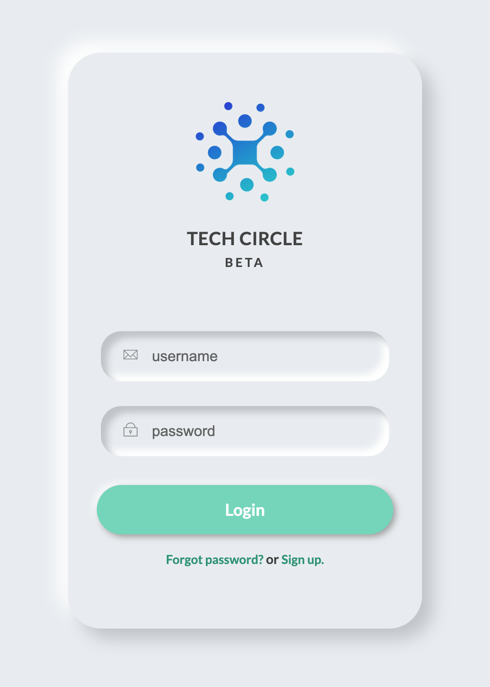

# Neumorphic Login Form

Github Pages Link:
https://tascraig.github.io/neophoric-form-design/

A simple neumorphic-styled login form with HTML and CSS.

## Description

This project implements a login form with a neumorphic design aesthetic using HTML and CSS. It includes fields for username and password input, with a login button and links for forgotten passwords and sign-up options.

## Screenshots

## Usage

To use this project, simply download or clone the repository and open the `index.html` file in a web browser.

## Credits

- [Font Awesome](https://fontawesome.com/) for the SVG icons used in the form fields.
- [Google Fonts](https://fonts.google.com/) for the "Lato" font used in the project.

## License

This project is licensed under the [MIT License](LICENSE).
